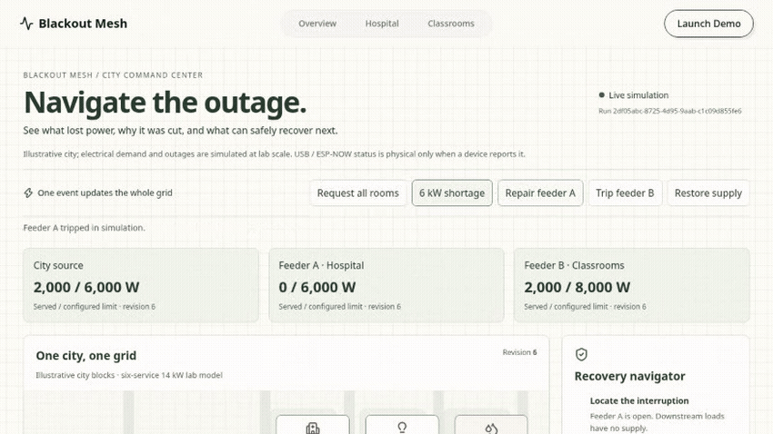

# Blackout Mesh



An offline campus outage-planning demonstration: given a declared topology, configured demand and an outage, explore which permitted recovery serves critical loads within modeled limits, and inspect its explanation. **Blackout Mesh** is the public name; PriorityGrid is the historical controller name. Geography is real; electrical assets, demand, switching and power delivery are synthetic.

**Real software:** a trained occupancy proxy, a synthetic-trained demand forecaster, 31-appliance OR-Tools CP-SAT allocation with independent validation, recorded history and an ESP32 USB/ESP-NOW bridge. **Simulated:** city power, demand, faults, switching and recovery. Physical LED confirmation appears only when the connected gateway reports a fresh acknowledgment. Physical end-to-end acceptance remains pending; B5 flashing/pairing/video is on hold.

Historical six-service benchmark medians (the 64-mask enumerator is now a regression fixture, not the production appliance solver): **0.17 ms** occupancy inference (100 warm calls), **1.59 ms** allocation (50 decisions), **0 constraint violations / 385 simulated runs**. These are different tasks, not a competing-controller speed comparison. [Measurement sources](docs/DEMO_GUIDE.md#evidence).

The 60-second demand forecast averaged **149.49 W error** versus **469.59 W** for last-value persistence on 20 held-out **synthetic** sessions. It warns about capacity risk and cannot authorize switching. Neither model establishes campus accuracy.

## Same shortage, simpler controllers

6 kW shortage · five seeds per policy · 40 simulated minutes per run. Switching counts are means.

| Policy | Occupied service | Switches | Essential unmet Wh | Critical unmet Wh |
|---|---:|---:|---:|---:|
| Fixed priority | 61.8% | 6.2 | 380.9 | 0.0 |
| Essentials-first, no ML | 84.9% | 6.6 | 205.1 | 0.0 |
| ML without rank dwell, validation-rate errors | 85.4% | 20.6 | 220.3 | 0.0 |
| ML with rank dwell, validation-rate errors | 85.2% | 15.0 | 221.9 | 0.0 |
| Always UNKNOWN | 84.9% | 6.6 | 205.1 | 0.0 |
| Oracle (offline only) | 85.8% | 7.8 | 219.9 | 0.0 |

The small occupied-service gain comes with more switches and unmet essential demand. ML is optional. Rank dwell reduces switching from 20.6 to 15.0 in this synthetic shortage, with a small occupied-service reduction. [Full results](backend/benchmarks/results/allocation_report.md).

## Run locally

From the repository root:

```sh
uv run --no-project --python 3.14 --with-requirements backend/requirements.txt --with-requirements backend/requirements-ml.txt python -m uvicorn app.main:app --app-dir backend --host 127.0.0.1 --port 8000
```

In another terminal:

```sh
cd frontend
npm ci --no-audit --no-fund
npm run dev
```

Open [the primary district planning demonstration](http://127.0.0.1:5173/grid). Inspect synthetic loads → inject a modeled line fault → propose recovery → inspect the reason and evidence gate. The current watt-budget calculation does not establish AC feasibility. For the existing appliance controller, use `/demo`; the legacy city/forecast story is `/city`. No API key, training step or paid service is required.

| Route | Model and demand catalog | Capacity and limits |
|---|---|---|
| `/grid` | GNITC real OSM geometry, synthetic district assets and 24 hourly demand/PV samples | Separately configured 6,000 W source; synthetic W limits; no AC authorization or physical commands |
| `/grid` with explicit `DISTRICT_PROFILE` opt-in | Six virtual rooms map all 31 catalog appliances into the synthetic GNITC graph | Separately named 14,000 W inventory study; graph path W budgets; PV/storage disabled |
| `/demo`, `/city`, `/console` | Existing campus, six services and 31 appliances | 14,000 W rated demand; separately controlled source and feeder budgets |
| `/hospital`, `/classrooms` | Equipment projections of the existing campus controller | Hospital 6,000 W; classrooms 8,000 W rated demand |

Power uses integer W and energy uses Wh. Routes do not share district switching state or silently rescale capacities. The historical nine-service catalog is deferred. [Integration delivery and remaining gates](docs/ISSUE_69_DELIVERY.md).

[Demo guide and checks](docs/DEMO_GUIDE.md) · [Planning](docs/planning/README.md) · [Model evidence](backend/models/MODEL_REPORT.md) · [Progress](PROGRESS_REPORT.md) · [Context](CONTEXT.md) · [Hardware guide](docs/ESP32_A_CONNECTION_GUIDE.md)
